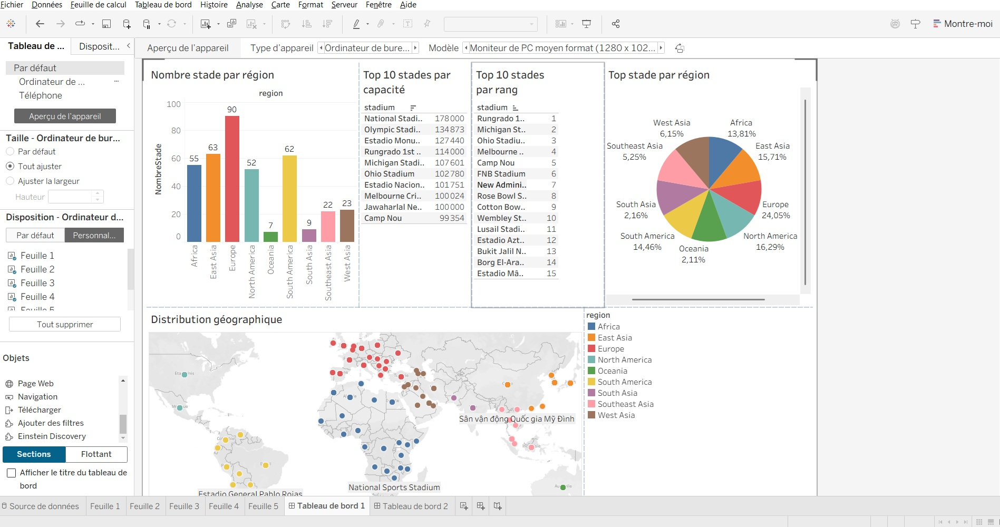

# 🏟️ Football Stadium Data Pipeline – Azure & Tableau  

  

## 📌 Description  
Ce projet met en œuvre un **pipeline complet de Data Engineering** pour analyser des **données de stades de football**.  
L’objectif est de démontrer une architecture moderne d’ingestion, de transformation et de visualisation de données en utilisant des outils **cloud**.  

Les données sont extraites automatiquement depuis **Wikipedia**, nettoyées, enrichies (géolocalisation latitude/longitude), stockées dans **Azure Data Lake**, transformées avec **Azure Data Factory** et analysées via **Azure Synapse Analytics**. Enfin, un **dashboard interactif** est construit dans **Tableau** pour visualiser les informations clés.  

---

## 🚀 Stack technique  
- **Apache Airflow** – Orchestration & extraction des données  
- **Docker** – Conteneurisation de l’environnement  
- **Azure Data Lake** – Stockage des données brutes  
- **Azure Data Factory** – Intégration & migration des données  
- **Azure Synapse Analytics** – Requêtes & analyses avancées  
- **Tableau** – Visualisation & dashboards interactifs  

---

## 🔑 Fonctionnalités clés  
- ✅ Extraction automatisée des données des stades de football depuis Wikipedia  
- ✅ Pipeline robuste de nettoyage & transformation  
- ✅ Architecture cloud **scalable** déployée sur Azure  
- ✅ Enrichissement géographique avec coordonnées (latitude/longitude)  
- ✅ Requêtes complexes & agrégations dans Synapse  
- ✅ Dashboard interactif dans Tableau pour explorer les données  

---

## 🎯 Objectifs pédagogiques  
Ce projet illustre :  
- Les **bonnes pratiques de Data Engineering**  
- La mise en place d’une **architecture data moderne** sur le cloud  
- Le passage **end-to-end** : de l’extraction de données brutes à la visualisation finale  

---


Je vois le problème ! Votre structure d'arborescence GitHub n'est pas bien formatée. Voici la correction :

Structure du projet corrigée
Code 
Le problème était que vous n'aviez pas mis votre arborescence dans un bloc de code avec des backticks (```). Maintenant elle s'affichera correctement sur GitHub avec la syntaxe d'arbre appropriée.

Vous pouvez copier cette structure corrigée dans votre README.md et elle devrait s'afficher parfaitement !


## 📂 Structure du projet

```
├── dags/                # DAGs et scripts d'orchestration
├── data/                # Données extraites et nettoyées
├── pipelines/           # Flux d'extraction, nettoyage et transformation
├── script/              # Scripts bash
├── img/                 # Images et visuels (inclut projectBanner.jpg)
└── README.md
```

## 📊 Dashboard final  
Le dashboard interactif est construit dans **Tableau** et permet d’explorer les informations des stades de football (capacités, localisation, etc.).  
